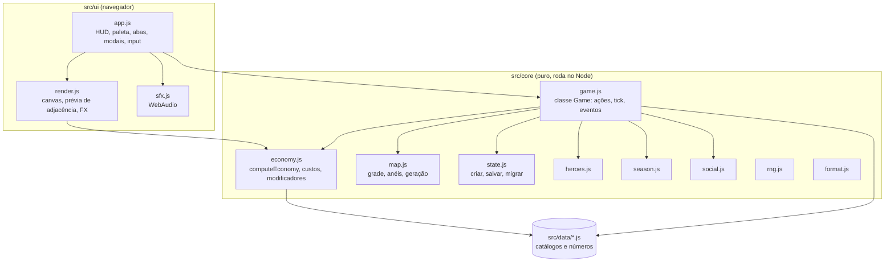
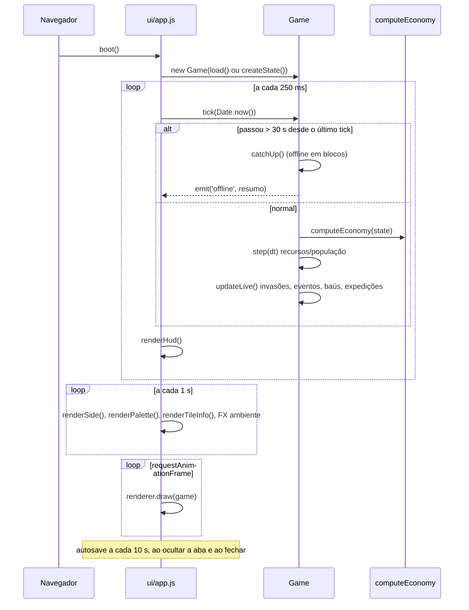
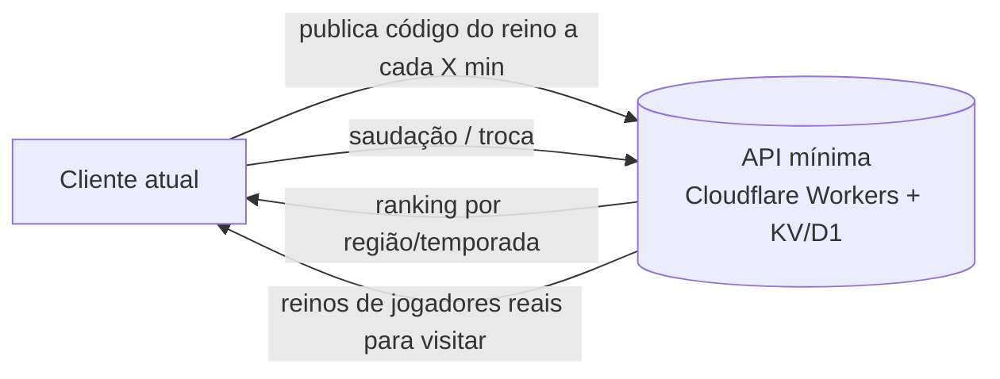

# Arquitetura

## 1. Princípios

| Princípio | Consequência |
|---|---|
| **Zero build, zero dependências** | ES modules nativos; roda em qualquer servidor estático; `npm` serve só para scripts |
| **Motor puro, separado da UI** | `src/core/` não toca no DOM e roda no Node (testes e simulador usam o mesmo código do jogo) |
| **Conteúdo é dado** | Prédios, heróis, eventos, talentos, temporadas e conquistas são objetos em `src/data/` (o conselho "crie uma máquina", da pesquisa) |
| **Estado único e serializável** | Um objeto JSON simples (`game.state`) = o save inteiro |
| **Derivar, não armazenar** | Produção, defesa, limites e felicidade são recalculados a cada tick por `computeEconomy` e nunca salvos |

## 2. Mapa de módulos



| Módulo | Responsabilidade | Exporta (principal) |
|---|---|---|
| `core/game.js` | Orquestra tudo; única API usada pela UI | `Game`, `TUTORIAL` |
| `core/economy.js` | Modificadores, adjacência, produção, custos, poder | `computeEconomy`, `adjacencyAt`, `buildCost`, `upgradeCost`, `collectModifiers` |
| `core/map.js` | Grade 12×12, anéis, vizinhos, gerador por semente | `generateMap`, `isUnlocked`, `neighbors`, `RING_COSTS` |
| `core/state.js` | Estado inicial, herança na Ascensão, (de)serialização, migração | `createState`, `carryOver`, `serialize`, `deserialize`, `exportSave`, `importSave` |
| `core/heroes.js` | Sorteio, estrelas, recompensas de expedição | `rollHero`, `addHero`, `expeditionReward` |
| `core/season.js` | Temporada pelo relógio, passe, missões diárias | `seasonInfo`, `syncSeason`, `dailyMissions` |
| `core/social.js` | Rivais determinísticos, cidade de rival, código do reino | `generateRivals`, `rivalGrid`, `encodeKingdom`, `decodeKingdom` |
| `core/rng.js` | PRNG (mulberry32), hash, chave do dia | `mulberry32`, `hashString`, `dayKey` |
| `ui/app.js` | Toda a interface; delegação de cliques por `data-action` | `boot` |
| `ui/render.js` | Desenho do mapa e efeitos no canvas | `MapRenderer` |
| `ui/sfx.js` | Sons sintetizados | `sfx`, `setSound` |

## 3. Ciclo de execução



- **Ações** (`build`, `upgrade`, `recruit`…) retornam `{ ok, reason? }`, recalculam a economia na hora e emitem eventos (`built`, `raid`, `recruited`…) que a UI transforma em som, partícula e toast.
- **Eventos do motor**: `toast`, `built`, `upgraded`, `sold`, `moved`, `cleared`, `expanded`, `raidWarning`, `raid`, `event`, `chest`, `chestOpened`, `recruited`, `expeditionStart`, `expeditionDone`, `tierUp`, `achievement`, `tutorial`, `offline`, `ascended`, `missions`.

## 4. Estado (save)

```jsonc
{
  "version": 1,
  "seed": 123456,                 // semente do mapa desta rodada
  "createdAt": 0, "runStartedAt": 0, "lastTick": 0,   // epoch ms
  "kingdom": { "name": "", "banner": "carmesim", "emblem": "coroa", "title": "Fundador" },
  "res":   { "gold": 0, "food": 0, "wood": 0, "stone": 0, "gems": 0, "crowns": 0 },
  "pop": 1,
  "grid":  { "w": 12, "h": 12, "ring": 2, "tiles": [ { "t": "grass|forest|rock|water|mountain", "b": null | { "id": "casa", "lvl": 1 } } ] },
  "heroes": { "owned": { "guarda": { "stars": 1, "expedition": null | { "id", "startedAt", "endsAt", "notified" } } }, "council": ["guarda"] },
  "items": { "scrolls": 1 },
  "raid":  { "level": 0, "nextAt": 0, "warned": false, "name": null },
  "event": null | { "id": "febre", "endsAt": 0 }, "nextEventAt": 0,
  "chest": null | { "x": 3, "y": 4, "expiresAt": 0 }, "nextChestAt": 0,
  "boostUntil": 0,
  "legacy": { "fartura": 2 },
  "season": { "number": 10, "xp": 0, "claimed": [1, 2], "missions": { "day": "2026-10-05", "list": [ { "id", "track", "target", "xp", "progress", "claimed" } ] } },
  "achievements": { "primeira-pedra": 1759600000000 },
  "cosmetics": { "banners": [], "emblems": [], "titles": ["Fundador"] },
  "daily": { "lastDay": "2026-10-05", "streak": 1 },
  "social": { "trades": { "r3": 0 }, "greets": { "r3": "2026-10-05" }, "rivalsSeed": 123456 },
  "tutorial": { "done": false, "step": 0 },
  "stats": { "totalGold": 0, "runGold": 0, "built": 0, "upgrades": 0, "raidsWon": 0, "raidsLost": 0, "recruits": 0, "goldRecruits": 0, "expeditions": 0, "chests": 0, "ascensions": 0, "cleared": 0, "visits": 0, "playTime": 0, "bestRaid": 0 },
  "settings": { "sound": true, "particles": true }
}
```

- **Onde**: `localStorage["reino-de-bolso:save"]`.
- **Exportar/Importar**: base64 do JSON (aba Perfil).
- **Migração**: `migrate()` mescla o save sobre um estado novo (campos novos ganham padrão). Para mudanças incompatíveis, adicione `if (data.version < N) { … }` e aumente `SAVE_VERSION`. Os testes cobrem saves parciais.
- **Ascensão**: `carryOver()` define exatamente o que persiste. Todo o resto nasce de novo em `createState({ carry })`.

## 5. Decisões técnicas

| Decisão | Alternativa | Por quê |
|---|---|---|
| Canvas 2D + sprites PNG pré-carregados | WebGL | 144 tiles cabem folgado no canvas 2D; o terreno fica em cache e só prédios e efeitos são redesenhados |
| HTML gerado por template string + delegação | Framework (React etc.) | Sem build; o painel é re-renderizado 1×/s e os cliques funcionam mesmo durante a re-renderização. Inputs focados não são re-renderizados |
| `Date.now()` real | Relógio de jogo próprio | Offline, expedições, temporada e missões diárias precisam do relógio real. O motor recebe `now` por parâmetro, então testes e simulador controlam o tempo |
| Offline simulado em blocos | Multiplicação simples taxa × tempo | Respeita limites, comida e crescimento populacional (taxas mudam durante a ausência) |
| Temporadas pelo relógio | Servidor de live-ops | Live-ops sem backend: todo mundo está na mesma temporada e nas mesmas missões do dia |
| Rivais determinísticos | Jogadores reais | Dá a sensação social já no protótipo; a interface (ranking, visitar, trocar) é a mesma que o backend real vai alimentar |

## 6. Como adicionar conteúdo

### Um prédio novo
1. Adicione o objeto em `BUILDINGS` (`src/data/buildings.js`) e o id em `BUILDING_ORDER`.
2. Se outros prédios devem gostar dele, adicione a chave no `adj` deles.
3. Nada mais: paleta, custo, adjacência, produção, painel e código do reino funcionam sozinhos.
   *Atenção:* o código do reino (`social.js`) mapeia prédios pela **posição** em `BUILDING_ORDER`, então adicione sempre no **fim** para não quebrar códigos já compartilhados.

### Um herói novo
Adicione em `HEROES` (`src/data/heroes.js`) com um `bonus.type` existente (lista no topo do arquivo). Para um tipo novo, trate-o em `collectModifiers` (`core/economy.js`) e em `describeBonus` (`ui/app.js`).

### Um evento relâmpago
Adicione em `EVENTS` (`src/data/events.js`). Modificadores suportados: `prod`, `cost`, `xp`, `raidLoot`, `triggersRaid`.

### Uma temporada
Adicione em `SEASON_THEMES` (`src/data/seasons.js`), o estandarte/emblema/título correspondentes em `cosmetics.js`, e suporte a qualquer `mods` novo em `collectModifiers`.

### Talento, conquista, missão diária
`TALENTS` (`effect(l)` retorna chaves de modificador), `ACHIEVEMENTS` (`check(state, econ, heroes)`), `MISSION_POOL` (`track` = nome passado para `game.track()`).

## 7. Testes e simulação

```bash
npm test                              # node --test tests/*.test.js
npm run simulate -- 8 1 --ascend      # horas, semente, política de prestígio
```

`tests/core.test.js` cobre: geração e garantias do mapa, determinismo, adjacência positiva e negativa, mina sem montanha, trabalho, mercados sem comida, custos, construir/melhorar/mover/demolir/limpar, falhas sem efeito colateral, limites no tick, invasões (novato, perda, teto, vitória), offline, estrelas e reembolso, conselho e expedições, Ascensão e herança, talentos de início, temporadas, missões, passe, sequência diária, código do reino (inclusive nível de 2 dígitos e XSS no nome), rivais, save e migração, formatação.

## 8. Modo debug

Abra `http://localhost:8080/?debug` e use o console:

```js
const g = reino.game;
Object.assign(g.state.res, { gold: 1e6, wood: 1e5, stone: 1e5, gems: 100 });  // recursos
g.state.raid.nextAt = Date.now() + 1000;            // forçar invasão
g.state.nextEventAt = Date.now();                   // forçar evento
g.state.nextChestAt = Date.now();                   // forçar baú
g.addXp(3000);                                      // XP de temporada
g.state.stats.runGold = 1e8;                        // liberar Ascensão
g.state.lastTick = Date.now() - 3 * 3600e3;         // simular 3 h offline
reino.save();                                       // salvar agora
```

## 9. Segurança e robustez
- Textos vindos do jogador ou de códigos de reino são escapados (`esc()` em `ui/app.js`) antes de ir para o HTML, e `setKingdomName` remove `<>`. Os testes garantem que um nome com `<script>` atravessa o código do reino intacto (como texto), e o escape acontece na renderização.
- `decodeKingdom` valida prefixo, tamanho da grade, ids de prédio e limita níveis e textos.
- Save ilegível → começa um jogo novo sem travar (com aviso no console).

## 10. Publicação na web (GitHub Pages)

O workflow `.github/workflows/pages.yml` roda `npm test` e publica a raiz do repositório a cada push na `main` (ou manualmente em *Actions → Publicar no GitHub Pages → Run workflow*). Como o jogo é estático e usa caminhos relativos, ele funciona em `https://<usuário>.github.io/<repo>/` sem build. O `.nojekyll` impede o GitHub de processar os arquivos com Jekyll.

**Configuração única:** *Settings → Pages → Build and deployment → Source: GitHub Actions*.

O save fica no `localStorage` do domínio `<usuário>.github.io`, com uma chave própria (`reino-de-bolso:save`), então não colide com outros sites do mesmo usuário.

## 11. Empacotamento para Steam (planejado)
- **Tauri** (preferido: binário pequeno) ou Electron apontando para `index.html`.
- Trocar `localStorage` por arquivo de save via API do wrapper + Steam Cloud.
- Steamworks: conquistas (já existe o catálogo `ACHIEVEMENTS`), Rich Presence ("Temporada 10 — Guerra, nível 14").
- Fontes locais (hoje vêm do Google Fonts, com fallback do sistema).

## 12. Caminho para social real



1. **Fase 1**: endpoint que recebe `encodeKingdom()` + poder e devolve o ranking. Os rivais simulados completam a tabela enquanto houver poucos jogadores.
2. **Fase 2**: visitas e saudações reais (o formato `RB1.` já é o payload).
3. **Fase 3**: guildas assíncronas com meta coletiva semanal (ex.: "derrotar 500 hordas juntos").

Anti-trapaça: o ranking é cosmético. Validação no servidor (limites plausíveis de poder por tempo de conta) basta para começar.
