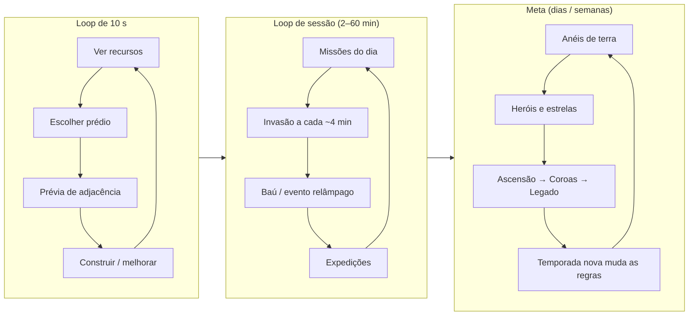

# 📘 Reino de Bolso: Documento de Design (GDD)

Versão 0.1 · Out/2026 · Status: **protótipo jogável completo**

> Os números aqui são os do código no momento da escrita. A fonte da verdade é `src/data/*.js`, e as fórmulas estão detalhadas em [BALANCEAMENTO.md](BALANCEAMENTO.md).

---

## 1. Visão

### 1.1 High concept
**Idle Tycoon 2D social onde a sua base é o jogo.** O jogador recebe um pedaço de terra com uma casa e uma fazenda e o transforma num reino. O quebra-cabeça central é espacial: **cada construção ganha ou perde produção conforme seus vizinhos.** Em volta desse núcleo giram as camadas que, segundo a pesquisa, sustentam os jogos mais rentáveis: progressão, economia, coleção, competição leve, temporadas, social e identidade.

### 1.2 Frase de elevador
*"Stardew encontra Clash of Clans num tabuleiro de 12×12: posicione, otimize, defenda e mostre seu reino aos amigos, em 5 minutos ou em 2 horas."*

### 1.3 Pilares (toda feature deve servir a pelo menos um)

| # | Pilar | O que significa na prática | Teste rápido para uma feature nova |
|---|---|---|---|
| P1 | **O lugar importa** | Decisões espaciais com trocas (floresta para a serraria × espaço para construir) | Ela cria uma decisão de *onde*, não só de *quando*? |
| P2 | **Só mais uma** | Sessões curtas recompensadoras (2–5 min) e um motivo para voltar | Dá para sentir progresso em 3 minutos? |
| P3 | **Esse reino é meu** | Identidade e status: nome, estandarte, títulos, layout único, código para compartilhar | O jogador consegue dizer "olha o que eu fiz"? |
| P4 | **Sempre há o próximo** | Camadas de progressão: prédio → nível → anel → herói → Coroa → temporada | Ela abre um objetivo novo sem fechar o antigo? |
| P5 | **Justo e gentil** | Nada se compra com dinheiro real; derrotas doem, mas não destroem | Um jogador gratuito e casual sai frustrado? |

### 1.4 O que NÃO é
- Não é 4X competitivo, PvP direto nem MMO (ver os riscos na [pesquisa](pesquisa-de-mercado.md#caminhos-para-o-seu-jogo)).
- Não tem campanha nem "missão final". Como em Minecraft, o jogador cria os próprios objetivos (o tutorial termina com essa frase).
- Não usa pay-to-win nem gacha pago.

## 2. Público, plataforma e sessão

| Item | Decisão | Por quê |
|---|---|---|
| Plataforma | Navegador (PC + celular) → Steam (Tauri/Electron) | Custo de entrada mínimo; a Steam paga melhor que o mobile para indie (78% da receita vem de jogos pagos) |
| Público | Fãs de idle/incremental, city builders leves e jogadores "de pausa" | A tag Idler cresceu ~150% em 2026 e bate 1.000 reviews com mais frequência que a média |
| Sessão casual | **2–5 min**: coletar, construir, mandar expedição, sair | Loop de mobile (Honor of Kings, Last War) |
| Sessão hardcore | **30–120 min**: otimizar adjacência, defender, completar missões e passe | Dois perfis de jogador no mesmo jogo |
| Idioma | PT-BR (i18n planejado; ver [ROADMAP](ROADMAP.md)) | Primeiro mercado: o próprio autor e a comunidade BR |

## 3. Loops

### 3.1 Primeira sessão (onboarding, D1)
1. Modal de fundação: nome do reino + estandarte (identidade desde o segundo 0).
2. Recompensa diária (dia 1).
3. **Primeiros passos** (opcionais, com recompensas pequenas):
   1. Serraria ao lado de floresta (ensina adjacência positiva).
   2. Mais uma casa (ensina população e trabalhadores).
   3. Recrutar com o pergaminho grátis (coleção).
   4. Muralha ou torre (prepara para a 1ª invasão aos 6 min).
   5. Mercado encostado em casas (economia + adjacência).
   6. Chegar a 10 construções: "não existe missão final".
4. Aos 6 min chega a 1ª invasão, com **proteção de novato** (perde só 5%).

### 3.2 Retorno (D1, D7, D30)
| Gancho | Sistema |
|---|---|
| "Meu reino produziu enquanto eu estava fora" | Progresso offline + modal de resumo |
| "Minha expedição voltou" | Expedições de 30 min a 2 h |
| "Não posso perder a sequência" | Recompensa diária de 7 dias |
| "Faltam 2 níveis no passe" | Passe de temporada + missões diárias |
| "A temporada mudou" | Modificador global a cada 28 dias |
| "Passei o vizinho no ranking" | Ranking regional |

## 4. Sistemas

### 4.1 Mapa e terreno
- Grade **12×12**, gerada por semente: rio na borda, lago perto do centro, aglomerados de floresta, rocha e montanha.
- Terra em **anéis concêntricos**: começa com 6×6 (anel 2); expansões abrem 8×8, 10×10 e 12×12.
- Garantias de geração: o anel inicial sempre tem ≥ 3 florestas, ≥ 2 rochas e ≥ 1 água, e o anel 3 tem ≥ 2 montanhas.

| Terreno | Constrói? | Pode limpar? | Usado por |
|---|---|---|---|
| Campo | ✅ | — | tudo |
| 🌲 Floresta | ❌ | ✅ 30💰 → +40🪵 | serraria (+40%) |
| 🪨 Rochas | ❌ | ✅ 50💰 → +30🪨 | pedreira (+50%) |
| 💧 Lago | ❌ | ❌ | fazenda (+50%), moinho (+25%) |
| ⛰️ Montanha | ❌ | ❌ | **mina (obrigatória)**, pedreira (+25%) |

**Decisão central (P1):** limpar uma floresta dá madeira e espaço agora, mas tira +40% de cada serraria vizinha para sempre.

### 4.2 Construções

| Prédio | Custo base | Trab. | Efeito (nv 1) | Gosta de (+) | Odeia (−) | Libera com |
|---|---|---|---|---|---|---|
| 🏠 Casa | 25💰 10🪵 | 0 | +4 moradores (×nível), 0,8💰/s × ocupação | mercado +50%, taverna +30%, fonte +30%, jardim +20%, casa +10% | pedreira −30%, mina −30% | início |
| 🌾 Fazenda | 20💰 | 2 | 1,2🍖/s | água +50%, moinho +50%, armazém +15%, fazenda +10% | — | início |
| 🪓 Serraria | 40💰 | 2 | 0,6🪵/s | floresta +40%, armazém +15% | — | início |
| ⛏️ Pedreira | 60💰 20🪵 | 2 | 0,6🪨/s, −2 felicidade | rocha +50%, montanha +25%, armazém +15% | — | 3 prédios |
| 🏪 Mercado | 120💰 40🪵 | 2 | 2💰/s consumindo 0,6🍖/s | casa +20%, armazém +15% | mercado −20% | 4 |
| 🌀 Moinho | 100💰 50🪵 | 1 | 0,4🍖/s | fazenda +25%, água +25% | — | 5 |
| 📦 Armazém | 150💰 80🪵 | 1 | +8.000💰 / +1.000 demais × nível² | — | — | 5 |
| 🍺 Taverna | 200💰 80🪵 20🪨 | 2 | +6 felicidade, 0,8💰/s | casa +15% | taverna −50% | 6 |
| 🧱 Muralha | 25🪨 | 0 | 3 defesa | muralha +25%, torre +25% | — | 6 |
| 🗼 Torre | 150💰 40🪵 60🪨 | 2 | 10 defesa | muralha +30%, torre +10% | — | 6 |
| 💰 Mina de Ouro | 500💰 150🪵 120🪨 | 4 | 5💰/s, −3 felicidade, **exige montanha** | montanha +60%, armazém +15% | — | 10 |
| ⛪ Templo | 800💰 300🪨 | 3 | +10 felicidade, +5% Coroas | casa +10%, jardim +20% | — | 14 |
| 🌳 Jardim | 60💰 | 0 | +2 felicidade (decoração, sem níveis) | — | — | 4 |
| ⛲ Fonte | 5💎 | 0 | +5 felicidade (decoração) | — | — | 8 |
| 🗿 Estátua do Fundador | 15💎 | 0 | +8 felicidade, +5% ouro global | — | — | 12 |

- **Níveis 1–10**: +75% de produção por nível; custo ×2,5 por nível; trabalhadores +50% do base por nível.
- **Cópias**: cada cópia do mesmo prédio custa ×1,12.
- **Mover** é grátis (incentiva experimentar layouts, P1). **Demolir** devolve 50%.

### 4.3 Adjacência
- Vizinhança **ortogonal** (4 vizinhos). Fácil de ler e de planejar.
- O bônus total soma os vizinhos e multiplica a produção do próprio prédio: `produção × max(0, 1 + Σ bônus)`.
- A chave de um vizinho é o **prédio**, se houver, ou o **terreno**.
- A herói Iara (Druida) amplia os bônus de terreno.
- Ao escolher um prédio, o mapa mostra **ao vivo** o bônus de cada vizinho (+40%, −30%…) e o total. O "momento aha" do jogo acontece aqui.

**Combos de referência**

| Nome | Layout | Resultado |
|---|---|---|
| Celeiro do rio | fazenda com 3 lados de água + moinho | +200% de comida |
| Bairro comercial | mercado no meio de 3–4 casas | mercado +60–80%, cada casa +50% |
| Serraria na clareira | serraria com 3 florestas + armazém | +135% de madeira |
| Fortaleza | torres alternadas com muralhas em linha | torres +60%, muralhas +50% |
| Vale dourado | mina entre duas montanhas + armazém | +135% de ouro |
| Erro clássico | pedreira encostada em casas | casas −30% e felicidade em queda |

### 4.4 População, trabalho e comida
- Casas definem a **capacidade**. A população cresce em direção a ela se houver comida, e mais rápido com felicidade alta.
- Cada morador come **0,15🍖/s**. Sem estoque de comida, a população cai, e os mercados só convertem o excedente.
- **Trabalho**: se os trabalhadores exigidos passam da população, *todos* os prédios com trabalhadores rendem `população / exigido`. O jogador precisa equilibrar casas e produção.
- Casas rendem impostos proporcionais à ocupação.

### 4.5 Felicidade
`50 + Σ prédios + heróis + temporada − 2 por cada 20 moradores`, limitada a 0–100.
Multiplica **toda** a produção: ×0,5 (0) a ×1,5 (100). Pedreiras e minas reduzem; tavernas, templos e decorações aumentam.

### 4.6 Armazenamento
Limite base de 2.500💰 e 500 para os demais recursos. Armazéns crescem com **nível²**, para acompanhar custos exponenciais. O limite cria o gancho do idle ("volte antes de lotar") e uma decisão de investimento: armazém × produção.

### 4.7 Expansão de território
| Anel | Área | Custo |
|---|---|---|
| 3 | 8×8 | 2.000💰 400🪵 |
| 4 | 10×10 | 60.000💰 4.000🪨 |
| 5 | 12×12 | 1.000.000💰 50.000🪨 |

A temporada *Expansão* corta 50%. O talento *Terras Ancestrais* começa rodadas com anéis já abertos.

### 4.8 Invasões (hordas)
- A 1ª chega aos 6 min; depois, a cada **4 min ±20%** (×0,6 na temporada *Guerra*). Há um aviso 20 s antes.
- Força `8 × 1,4^nível`. Defesa = Σ defesa dos prédios × trabalho + poder dos heróis do Conselho, × bônus.
- **Vitória**: saque de ouro (força ou 45 s de renda, o que for maior), 1+ gema, nível +1.
- **Derrota**: perde 15% dos recursos (5% nas 2 primeiras, a proteção de novato), **limitado a 2 min de produção** de cada recurso, e o nível cai 1.
- As invasões **não acontecem offline**. Ao voltar, a próxima espera pelo menos 90 s.

> **Por quê:** o nível sobe a cada vitória, então a defesa vira uma corrida que o jogador escolhe correr. A derrota baixa o nível (o jogo se autorregula), e o teto de saque garante que poupar para grandes metas continua viável (problema encontrado pelo simulador; ver [BALANCEAMENTO](BALANCEAMENTO.md#historico-de-ajustes)).

### 4.9 Heróis
16 heróis em 4 raridades: **Comum 60% · Raro 28% · Épico 10% · Lendário 2%**.

| Herói | Raridade | Poder | Bônus (★1) |
|---|---|---|---|
| 🧑‍🌾 Marta, a Lavradora | Comum | 2 | +15% comida |
| 🪵 Tito, o Lenhador | Comum | 3 | +15% madeira |
| 🧱 Joca, o Pedreiro | Comum | 3 | +15% pedra |
| 🛡️ Guarda Bento | Comum | 5 | +15% defesa |
| 🪙 Lia, a Coletora | Comum | 2 | +10% ouro |
| 🧕 Dona Safira | Raro | 4 | +20% ouro |
| 🏹 Ayla, a Arqueira | Raro | 10 | +25% defesa |
| 🎻 Rui, o Bardo | Raro | 3 | +8 felicidade |
| 🧭 Nina, a Exploradora | Raro | 6 | +30% expedições |
| 📐 Helena, a Arquiteta | Épico | 6 | −15% custo de obras |
| ⚔️ Sir Dourado | Épico | 20 | +50% saque |
| ⚗️ Zé Alquimista | Épico | 8 | +10% toda produção |
| 🌿 Iara, a Druida | Épico | 9 | +50% adjacência de terreno |
| 👑 Rainha Aurora | Lendário | 25 | +25% toda produção |
| 🐉 Brasa, o Dragão | Lendário | 50 | +100% defesa |
| ⏳ O Relojoeiro | Lendário | 10 | +25% eficiência offline, +4 h de limite |

- **Recrutar**: pergaminho (1 grátis no início, mais pelo passe, sequência diária e expedições), ouro (300 × 1,6ⁿ) ou 15💎.
- **Estrelas**: duplicata = +1★ (máx. 5). Bônus × (1 + 0,5 × (★−1)) e poder × ★. Duplicata com ★5 vira gemas.
- **Conselho**: 3 vagas (+2 com talento). Só heróis no Conselho dão bônus e defendem.
- Cada herói tem uma frase de *lore* curta e engraçada, pensada para clipes e memes.

### 4.10 Expedições
Heróis **fora** do Conselho podem partir (troca: bônus agora × recompensa depois).

| Expedição | Duração | Gemas | Pergaminho |
|---|---|---|---|
| Patrulha | 1 min | 5% (1) | — |
| Exploração | 5 min | 25% (1–2) | 2% |
| Jornada | 30 min | 60% (1–4) | 6% |
| Grande Expedição | 2 h | 100% (3–8) | 15% |

Recompensa em ouro/madeira/pedra proporcional à renda atual × duração × poder do herói. Acelerar custa 1💎 por 10 min restantes.

### 4.11 Eventos relâmpago e baú do mercador
A cada 6–10 min online (×2 na *Catástrofe*), um evento de 60–120 s:

| Evento | Efeito |
|---|---|
| 🎉 Festival da Colheita | comida ×3 |
| 🤑 Febre do Ouro | ouro ×2 |
| 🔨 Mutirão | construções −30% |
| ✨ Inspiração Real | XP de temporada ×2 |
| 🌕 Lua de Sangue | horda em 30 s com saque ×3 |
| 🐪 Caravana Exótica | madeira e pedra ×2 |

**Baú do mercador 🎁**: aparece num tile vazio a cada 100–220 s e some em 20 s. Dá ouro (60 s de renda), madeira+comida, gemas, pedra ou uma bênção (+50% por 2 min). É o "golden cookie" do jogo, feito para criar momentos de reação.

### 4.12 Temporadas, passe e missões
- **Temporadas de 28 dias**, calculadas pelo relógio (sem servidor), em rotação:

| Tema | Modificador global |
|---|---|
| 🏗️ Fundação | ouro +10%, casas +25%, obras −10% |
| ⚔️ Guerra | hordas ×1,67 mais frequentes, saque +100%, defesa +25% |
| 🗺️ Expansão | terras −50%, expedições +50% |
| 🌋 Catástrofe | eventos ×2, felicidade −10, Coroas +50% |

- **Passe gratuito de 30 níveis** (300 XP cada): gemas, pergaminhos, bênçãos, ouro e cosméticos exclusivos da temporada (estandarte no 14, emblema no 21, título "Campeão da …" no 30).
- **XP**: construir 2, melhorar 3, vencer invasão 15, expedição 10–40, baú 5, recompensa diária 50, missões 50–130.
- **Missões diárias**: 3 sorteadas por data (iguais para todos no mesmo dia, o que permite compartilhar dicas).

### 4.13 Recompensa diária
Sequência de 7 dias: 200💰 → 2💎 → 10 min de ouro → 3💎 → bênção 15 min → 5💎 → pergaminho. Pular um dia reinicia a sequência.

### 4.14 Ascensão (prestígio) e Legado
- Coroas = `⌊√(ouro da rodada / 1.000.000) × (1 + 5% por templo + bônus da temporada)⌋`.
- **Ao ascender**, o reino (prédios, recursos, terras) recomeça num **mapa novo**.
- **Persistem**: heróis, gemas, Coroas, talentos, temporada, conquistas, cosméticos, estatísticas e sequência.

| Talento | Efeito por nível | Máx. | Custo (👑) |
|---|---|---|---|
| 🌽 Fartura | +10% toda produção | 20 | 1, 2, 3… |
| 🪙 Herança | +500💰 +200🪵 iniciais | 5 | 1, 2, 3… |
| 🏰 Muralhas Eternas | +20% defesa | 10 | 1, 2, 3… |
| 🌙 Vigília | +2 h de limite e +8% de eficiência offline | 5 | 2, 4, 6… |
| 📏 Engenharia | −5% custo de obras | 6 | 2, 4, 6… |
| 💎 Garimpo | +1 gema por vitória | 3 | 4, 8, 12 |
| 🗺️ Terras Ancestrais | +1 anel inicial | 2 | 5, 10 |
| 🪑 Mesa Redonda | +1 vaga no Conselho | 2 | 8, 16 |
| 🤵 Mordomo Real | baús coletados sozinhos | 1 | 10 |

### 4.15 Identidade e conquistas
- Nome do reino, **estandarte** (cor), **emblema** e **título**, sempre visíveis no topo e no ranking.
- 4 estandartes e 4 emblemas grátis; outros por gemas ou exclusivos de temporada.
- **24 conquistas**, que dão gemas e, várias delas, títulos ("Urbanista" por +150% de adjacência, "Imperador" por 5 ascensões…).

### 4.16 Social assíncrono
- **Ranking regional**: 9 reinos vizinhos determinísticos (semente do jogador) que crescem com o tempo, + o jogador. "Poder do Reino" = √(ouro da vida toda) + 10/nível de prédio + 40/★ de herói + 500/ascensão + 15/vitória.
- **Visitar** (vê a cidade do vizinho), **saudar** (1×/dia, +10 XP, 25% de chance de 1💎) e **trocar** (1×/h por vizinho: 25% da madeira/pedra por ouro).
- **Código do reino** (`RB1.…`): exporta o layout real; um amigo cola e vê a cidade. É social de verdade, sem servidor.
- O backend real (visitas, guildas e trocas entre jogadores) está planejado em [ARQUITETURA](ARQUITETURA.md#caminho-para-social-real) e [ROADMAP](ROADMAP.md).

### 4.17 Progresso offline
- Simula até **4 h** (+2 h por nível de Vigília, +4 h por ★ do Relojoeiro) a **60%** de eficiência (+8% por Vigília, +25% por ★ do Relojoeiro; máx. 100%).
- A simulação roda em blocos e respeita limites, comida e crescimento populacional. Depois, um modal mostra o resumo.

## 5. UX e interface

| Área | Conteúdo |
|---|---|
| Topo (HUD) | Brasão + nome + título + poder · recursos com taxa e barra de limite · gemas · população/trabalho · felicidade · **defesa × próxima horda + cronômetro** · evento ativo · bênção |
| Esquerda | Paleta de construções (custo em vermelho quando falta recurso, cadeado com requisito, atalho 1–9) |
| Centro | Mapa em canvas · barra de "Primeiros passos" · dica do modo (sobreposta, sem empurrar o mapa) · painel do tile selecionado |
| Direita | Abas: Reino, Heróis, Temporada, Legado, Social, Perfil (ponto vermelho quando há algo a resgatar) |
| Celular | Tudo vira coluna: HUD fixo e compacto, mapa, paleta horizontal, abas; toque duplo para construir |

**Feedback e "suco"**: partículas e números flutuantes de produção, explosão de faíscas ao construir/melhorar, tremor de tela e flash vermelho na derrota, flash dourado na vitória, revelação animada de herói com brilho da raridade, sons sintetizados (WebAudio, sem arquivos), toasts para tudo que acontece.

## 6. Arte e áudio
- **Agora**: emojis + terreno procedural em canvas, com paleta "medieval aconchegante à noite" (roxos profundos + dourado). Custo zero, leitura imediata e estilo coeso.
- **Para a Steam**: trocar emojis por um *sprite atlas* 32×32 pixel art (o renderizador desenha por id, então a troca fica isolada em `render.js`). Ver [ROADMAP](ROADMAP.md).
- **Áudio**: blips sintetizados por evento. Para a Steam, uma trilha lo-fi medieval em loop e ambiência que muda por temporada.

## 7. Glossário
| Termo | Significado |
|---|---|
| Anel | Faixa concêntrica de terra desbloqueável |
| Conselho | Heróis ativos (bônus + defesa) |
| Coroa 👑 | Moeda de prestígio, ganha ao Ascender |
| Bênção | +50% de toda produção por tempo limitado |
| Trabalho (staffing) | Fração dos trabalhadores exigidos que existe de fato |
| Poder do Reino | Pontuação do ranking social |
